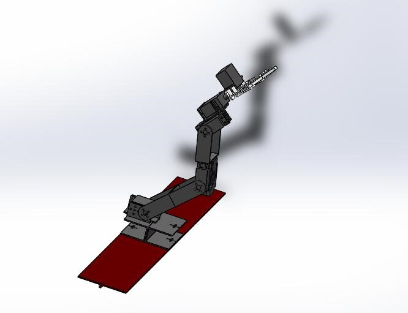

# Snap

## Description

The system is based on machine vision and robotic control for sorting yellow leaves from vegetables. 

First, the camera completes the acquisition of the image data of the obtained RGB color image segmentation 
and image processing to obtain the binarization contour vegetables and average color histogram, 
automatic screening algorithm requires sorting through yellow leaves; secondly, 
considering run error of the asembly line, calculate the centroid; 
then PC calculate the corresponding steering angle control,  converting the calculated value into control 
commands which was transported through the serial port; finally, basing on the ARM controller, servo rotate. 


## Features

* Sorting yellow leaves from the vegetables in real time
* Through the serial port sends commands to the ARM control board

## Requirements

* OpenCV 3.0
* C/C++ using Microsoft Visual Studio 2013 IDE
* registered mscomm32.ocx

## Hardware Environment


#### For servo control
we use servo like this:



* we can control the servo by command
```
#1P900#2P1100#3P544#4P1144#5P2144#6P21100T500
```

## Project samples (Youtube video):
[](https://youtu.be/lTUlrcDPlNk)
